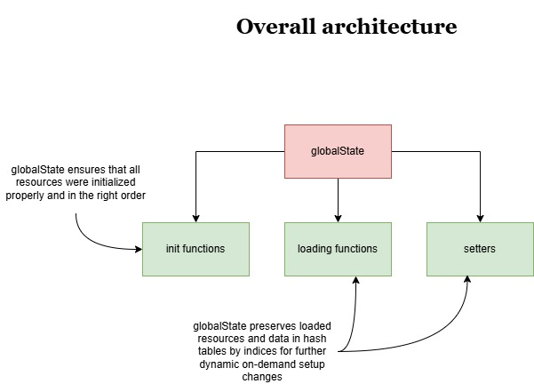
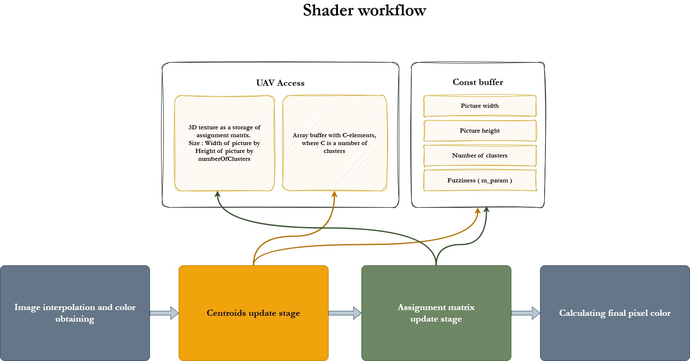
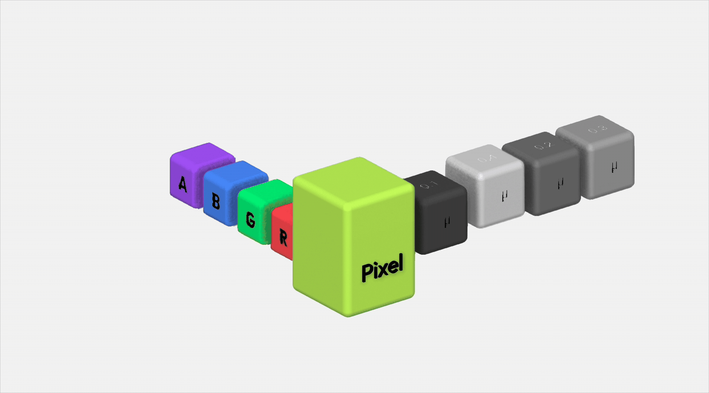

# GPU-based-fuzzy-clustering
---
# Brief overview
Current repository is assumed to contain a GPU-based implementation of clustering algorithms, in particular, Fuzzy-C-Means and its spatial modification for image segmentation. DirectX acts as the main technology in image processing and the segmentation itself. Most likely the final result of the development will be arranged as a framework with simple one-image-one-window output. The whole project is the part of pre-graduate internship.

---
# Description
## Core idea
- Develop GPU-based hardware accerelated solution of clustering algorithms;
- Develop sustainable and scalable framework-like infrastracture for further diploma project research;

## Technologies used
- C++, for general programming
- HLSL, for GPU-side clustering algorithms computations
- DirectX (Direct3d), to process graphics and connect GPU capabilities to application
- Windows API, for windows creation

## Usefulness
- In perfomance-critical fuzzy image segmentation applications
- (The following lacks evidence of sufficient speed : ) For low-resolution real-time image segmentation

---
# How to run and install
1. Install Visual Studio
2. Install regular packages for programming in C++
3. Clone this repo
4. Run the solution from cloned repo
5. Build a solution
6. Run a program

# Internal mechanism
## Overview
This section describes the very logic of how FCM is processed while taking into account the workflow ot both CPU and GPU sides for each stage of execution. There're two main stages can be highlighted, mainly because they're the core of FCM itself. In particular these are updating centroids and updating assignment matrix. Besides these, there's a few supplement steps present, such like assignment matrix initialization, graphics setup of the shader and required resources, making drawcalls.

--- IMPORTANT - CPU side instructions are quite well planned but not introduced in the current state of the code implementation. Only shader with GPU computations was made by now.

## Updating centroids
### CPU side
- Obtaining the data from RWStructuredBuffer
- Performing conversion of UINT to FLOAT, accomplishing corresponding division to calculate actual values of centroids
- Updating StructuredBuffer with correct float values of centroids
### GPU side
- Going through all centroids in a loop
- Each iteration of a loop accompanied with calculating nominator and denominator of the centroids updating formula.
- Each calculated pair is then casted to uint though precision multipliers and summed into RWStructuredbuffer with thread-safe function.

## Updating assignment matrix
### CPU
3D texture isn't used on the side of CPU and has a pure GPU read/write workflow.
### GPU
Here the most direct update of assignment matrix occurs. For this purposes 3D texture utilized only.

# Basic graphics acrhitecture

# Overall GPU-FCM workflow

# Pixel data (RGBA + Assignment values)

